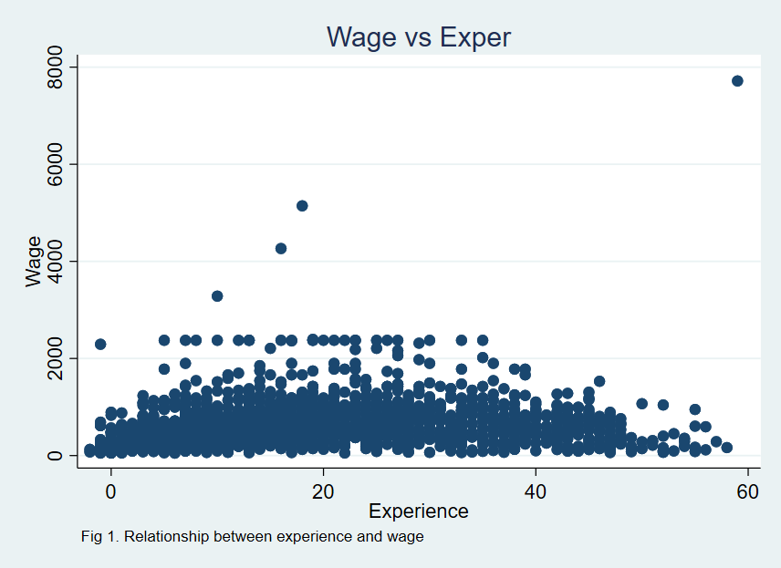
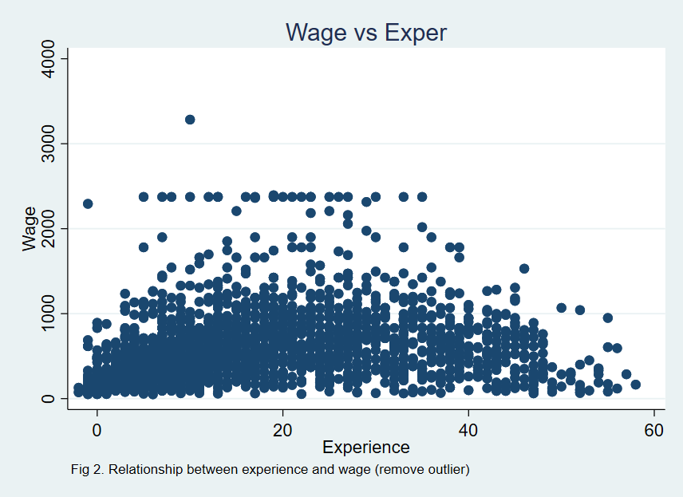
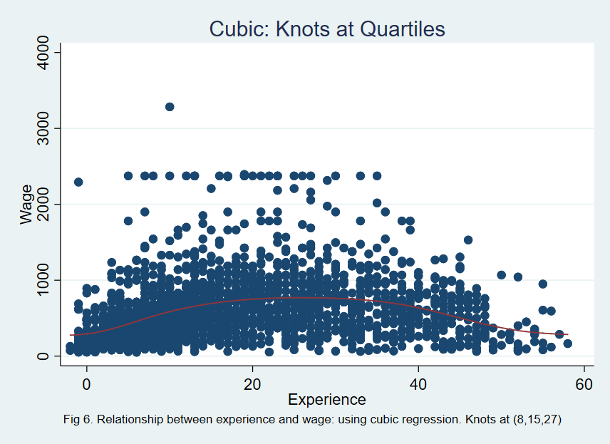
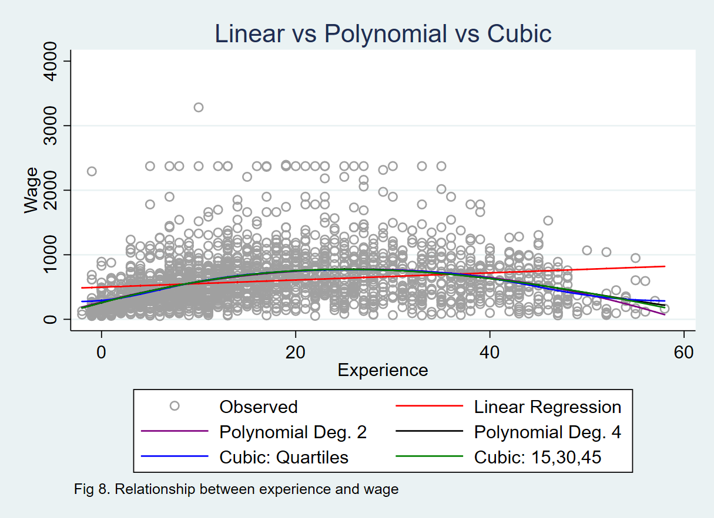

```{r, echo=FALSE, message=FALSE}
require(knitr)
statapath <- "C:/Program Files (x86)/Stata15/Stata-64.exe"
opts_chunk$set(engine="stata", engine.path=statapath, comment="")
```


# II. Applying Cubic Regression Spline with Stata

## 1. Loading Packages

In this tutorial, stata is used to perform the analysis. To build the cubic spline regression model, a package called bspline is needed. More information about the package can be found here (https://www.stata-journal.com/sjpdf.html?articlenum=sg151_2)

```{stata, results = "hide"}

ssc install bspline
ssc install markstat
ssc install whereis

```

## 2. Import Dataset

We start by loading the data and presenting the first 4 observations.

```{stata}
import delimited uswages.csv
list in 1/4
```

## 3. Data Exploration

This dataset is exploring how wages in the U.S. are affected by certain variables. For simplicity, we will be regressing the variable experience onto wage and looking at the resulting relationship. First we will visualize how these 2 variables are related. We notice that wage and experience has a non-linear relationship. We can also see that there seems to be a few outliers. We remove data points where wage is greater than 4000.

```{stata}
import delimited uswages.csv
summarize
summarize wage exper, detail
```

```{stata}
import delimited uswages.csv

twoway (scatter wage exper), ytitle(Wage) xtitle(Experience) legend(off) note("Fig 1. Relationship between experience and wage") title("Wage vs Exper") name(Scatter)

```

[](https://github.com/xiaotoYang/CubicSpline/blob/master/stata_graph1.png)

```{stata}
import delimited uswages.csv

drop if wage > 4000

twoway (scatter wage exper), ytitle(Wage) xtitle(Experience) legend(off) note("Fig 2. Relationship between experience and wage (remove outlier)") title("Wage vs Exper") name(Scatter2)

```

[](https://github.com/xiaotoYang/CubicSpline/blob/master/stata_graph2.png)

## 4. Simple Linear Regression

First we will do OLS Regression. From Fig 3., it does not appear that linear regression is suitable to explain the relationship between wage and experience. We note from the output that the RMSE value is 404.95.

```{stata, message = FALSE}
import delimited uswages.csv

regress wage exper
predict linear_wage_exper
twoway (scatter wage exper)(line linear_wage_exper exper, sort), ytitle(Wage) xtitle(Experience) legend(off) note("Fig 3. Relationship between experience and wage: using simple linear regression") title("Linear") name(Linear)

```

[](https://github.com/xiaotoYang/CubicSpline/blob/master/stata_graph3.png)

## 5. Polynomial Regression

Next we perform polynomial regression and fit a quadratic by setting "experience" to degree = 2. The polynomial seems to explain the non-linearity somewhat better than linear regression. We note from the output that the RMSE value is 381.67.

```{stata}
import delimited uswages.csv

regress wage c.exper##c.exper
predict quad_wage_exper
twoway (scatter wage exper)(line quad_wage_exper exper, sort), ytitle(Wage) xtitle(Experience) legend(off) note("Fig 4. Relationship between experience and wage: using polynomial regression") title("Polynomial: Degree 2") name(Degree2)

```

[](https://github.com/xiaotoYang/CubicSpline/blob/master/stata_graph4.png)

## 6. Polynomial Regression to the 4th Degree

Next, we'll try adding a higher degree of experience to the model.

```{stata}
import delimited uswages.csv

regress wage c.exper##c.exper##c.exper##c.exper
predict degfour_wage_exper
twoway (scatter wage exper)(line degfour_wage_exper exper, sort), ytitle(Wage) xtitle(Experience) legend(off) note("Fig 5. Relationship between experience and wage: using polynomial regression") title("Polynomial: Degree 4") name(Degree4)
```

[](https://github.com/xiaotoYang/CubicSpline/blob/master/stata_graph5.png)

The curve looks similar to Fig 4. Note that the RMSE is 381.67

## 7. Cubic Regression, Knots = 8, 15, 27

For the cubic regression model, we select 8, 15, and 27 as our knots, which are the 25th, 50th, and 75th quartiles for the experience variable. Here we use the bspline package. 

```{stata}
import delimited uswages.csv

bspline, xvar(exper) knots(8,15,27) gen(cubic_wage_exper_spline) power(3)
regress wage cubic_wage_exper_spline*
predict cubic_wage_exper_spline
twoway (scatter wage exper)(line cubic_wage_exper_spline exper, sort), ytitle(Wage) xtitle(Experience) legend(off) note("Fig 6. Relationship between experience and wage: using cubic regression. Knots at (8,15,27)") title("Cubic: Knots at Quartiles") name(Cubic)

```


[](https://github.com/xiaotoYang/CubicSpline/blob/master/stata_graph6.png)

The cubic regression spline also seems to model the non-linear relationship better than a linear fit, although it does not look significantly different from the polynomial regressions performed earlier. Note the RMSE value of 382.23.


One may notice that the coefficients produced from the cubic regression in Stata compared to Python and R look quite different. We attempt to explain this in the Discussion section below.

## 8. Cubic Regression, knots = 15, 30, 45

Next, we select evenly spaced knots at 15, 30, and 45 and perform the cubic regression again.

```{stata}
import delimited uswages.csv

bspline, xvar(exper) knots(15,30,40) gen(cubic_wage_exper_spline_even) power(3)
regress wage cubic_wage_exper_spline_even*
predict cubic_wage_exper_spline_even
twoway (scatter wage exper)(line cubic_wage_exper_spline_even exper, sort), ytitle(Wage) xtitle(Experience) legend(off) note("Fig 7. Relationship between experience and wage: using cubic regression. Knots at (15,30,40)") title("Cubic: Evenly Spaced Knots") name(Cubic2)
```

[](https://github.com/xiaotoYang/CubicSpline/blob/master/stata_graph7.png)

The spline curve from Fig 7. is slightly different from that of Fig 6. at higher values of experience. We suspect this might be due to lower sample size at the last knot. Note the RMSE value of 381.95.

## 9. Summary

Looking at a plot of all of the curves, we can see that the splines and polynomial curves overlap each other somewhat. In python and R, the spline's RMSE is slightly smaller than the polynomial's. However, in Stata, the spline's RMSE is slightly bigger than the polynomial's. We still might expect the cubic fit to be a little more accurate because of the local influence property from the knots.

```{stata, message = FALSE, echo = FALSE, warning = FALSE, include = FALSE}
import delimited uswages.csv

twoway (scatter wage exper)(line linear_wage_exper quad_wage_exper degfour_wage_exper cubic_wage_exper_spline cubic_wage_exper_spline_even exper, sort), ytitle(Wage) xtitle(Experience) legend(label(1 "Observed") label(2 "Linear Regression") label(3 "Polynomial Deg. 2") label(4 "Polynomial Deg. 4") label(5 "Cubic: Quartiles") label(6 "Cubic: 15,30,45")) note("Fig 8. Relationship between experience and wage") title("Linear vs Polynomial vs Cubic") name(All)

```

[](https://github.com/xiaotoYang/CubicSpline/blob/master/stata_graph7.png)

# Discussion

The coefficients for the cubic spline regression in Stata look quite different from the coefficients from R and Python. We believe that this could possibly be due to how the spline functions are scaled in the bspline package. If $y(t) = \sum x_i(t)\beta_i$, it could also be that $y(t) = \sum (\frac{x_i(t)}{C}) * C\beta_i$ where C is some constant. We believe this is happening here.

We can try to reproduce the cubic spline regression results with knots at 8, 15, 27 from scratch using the basis functions. We can then sum the predictions from the bspline package and those from scratch and compare. More information about rescaling of the basis functions can be found here (https://www.researchgate.net/publication/4794073_BSPLINE_Stata_modules_to_compute_B-splines_parameterized_by_their_values_at_reference_points
)

```{stata}
import delimited uswages.csv

gen exper2 = exper^2
gen exper3 = exper^3
gen k8 = cond(exper > 8, (exper - 8)^3, 0)
gen k15 = cond(exper > 15, (exper - 15)^3, 0)
gen k27 = cond(exper > 27, (exper - 27)^3, 0)
regress wage exper exper2 exper3 k8 k15 k27
predict cubic_wage_exper

bspline, xvar(exper) knots(8,15,27) gen(cubic_wage_exper_spline) power(3)
regress wage cubic_wage_exper_spline*
predict cubic_wage_exper_spline

sum cubic_wage_exper cubic_wage_exper_spline
```

