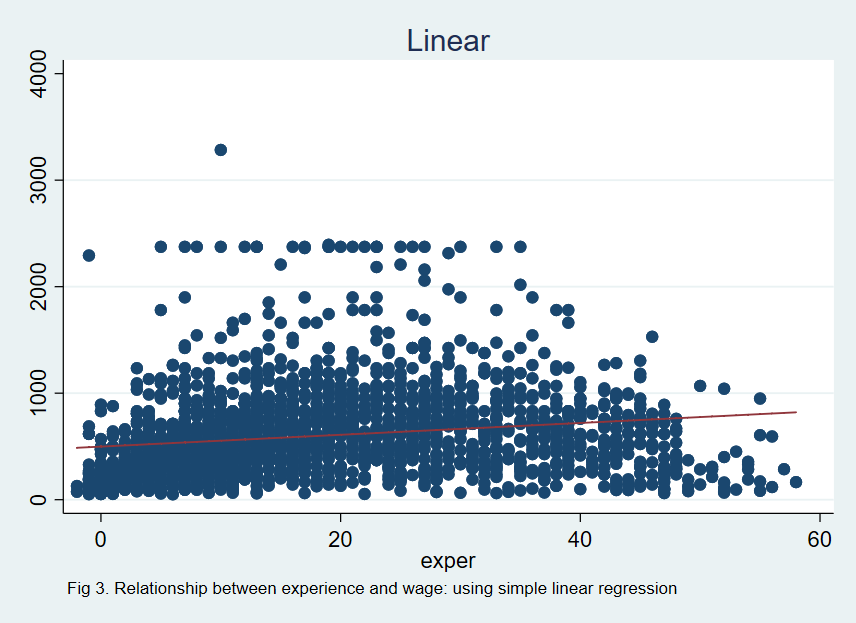
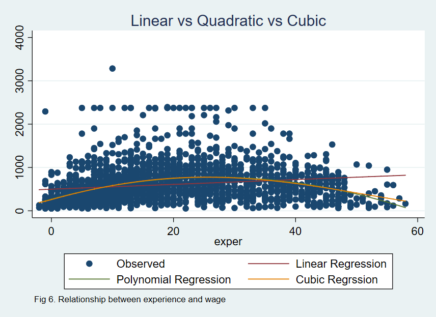

```{r setup, include=FALSE}
knitr::opts_chunk$set(echo = TRUE)
library(splines)
library(faraway)
library(dplyr)
library(ggplot2)
library(knitr)
library(reticulate)
use_python("/Users/mandy/anaconda3/bin/python")
```


## Introduction to Cubic Spline Regression

Cubic regression spline is a form of generalized linear models in regression analysis. Also known as B-spline, it is supported by a series of interior basis functions on the interval with chosen knots. Cubic regression splines are widely used on modeling nonlinear data and interaction between variables. Unlike traditional methods such as polynomial regression or broken stick regression, cubic regression spline takes both smoothness and local influence into consideration (Faraway, 2015). According to Julian J Faraway, the basis functions need to be a continuous cubic polynomial that is  nonzero on an interval defined by knots and zero anywhere else to ensure the local influence. Also smoothness require their first and second derivatives at each knotpoint to be continuous  (Faraway, 2015). More details of cubic regression spline can be found at [link](http://data.princeton.edu/eco572/smoothing2.html)


## Data Summary

In this project, we'll be using data set uswages from R package faraway. The data set can be found at [link](https://github.com/xiaotoYang/CubicSpline/blob/master/uswages.csv.) The description of variables are as follows:

```{r data, include = FALSE}
data(uswages)
type = as.character(sapply(uswages, typeof))
explain = c("Real weekly wages in dollars",
            "Years of education",
            "Years of experience",
            "1 if Black, 0 if White (other races not in sample)",
            "1 if living in Standard Metropolitan Statistical Area, 0 if not",
            "1 if living in the North East",
            "1 if living in the Midwest",
            "1 if living in the West",
            "1 if living in the South",
            "1 if working part time, 0 if not"
            )
var_explain = as.data.frame(cbind("Variables" = names(uswages), "Type" = type, "Explanation" = explain))
```

```{r data_table}
kable(var_explain, caption = "Variable description")
```

In this tutorial, we will focus on the relationship between response variable wage and prediction variable experience. The two-dimensional relationship is easier to present and allows us to better illustrate cubic regression spline method.

## Applying Cubic Regression Spline with R

#### Data Cleaning

Regression spline methods are easy to apply with R packages splines. To load data and draw plots, package faraway and ggplot2 are also needed.

```{r load}
library(splines)
library(faraway)
library(ggplot2)
library(dplyr)
data(uswages)
ggplot(uswages, aes(exper, wage))+geom_point(col = "slategrey") + ggtitle("Relationship between weekly wages and years of experience")
```

From the plot, we can observe that there are a few outliers with extremely high wage. To avoid the influence of outliers on regression models, we remove observations with wage larger than 4000.

```{r clean}
uswages = filter(uswages, wage<4000)
```

First, let's try to capture the relationship with ordinary least square model (ols). 

```{r ols}
fit1 = lm(wage~exper, data = uswages)
plot(uswages$exper, uswages$wage, xlab = "Weekly wage", 
     ylab = "Experience", main = "OLS model", col = "slategrey")
abline(fit1, col = "red")
```

From the plot, we can see that OLS model fails to catch most of the variabnce in the data. 

Polynomial regression is a good alternative in this case. The linear models with polynomial of degree 2 and degree 4 are shown as follows:

```{r poly}
g2 = lm(wage~poly(exper, 2), data = uswages)
g4 = lm(wage~poly(exper, 4), data = uswages)
uswages = mutate(uswages, degree2 = fitted(g2), degree4 = fitted(g4))
ggplot(uswages, aes(exper, wage)) +
  geom_point( col = "slategrey") + 
  geom_line(aes(exper, degree2,color = "2"))+
  geom_line(aes(exper, degree4,color = "4")) +
  scale_color_manual(values = c(
    '2' = 'darkblue',
    '4' = 'red')) +
  labs(color = 'Polynomial degree')+
  ggtitle("Polynomial regression models")
```


```{r spline}
cubic_spline = lm(wage~bs(exper, knots = c(0, 20, 40, 58)), data = uswages)
uswages = mutate(uswages, smooth = fitted(cubic_spline))
ggplot(uswages, aes(exper, wage)) + 
  geom_point(col = "slategrey") +
  geom_line(aes(exper, smooth), col = "red") + 
  ggtitle("Cubic regression spline model")
```


## Applying Cubic Regression Spline with Python
# 1. Loading packages
In this python tutorial, pandas is required for data manipulation, statsmodel is require for building regression models and matplolib is for plotting.
```{python}
import numpy as np
import pandas as pd
import statsmodels.api as sm
import statsmodels.formula.api as smf
import matplotlib.pyplot as plt
from math import sqrt
from sklearn.metrics import mean_squared_error
from patsy import dmatrix
from scipy import interpolate
```

# 2. Import dataset using pandas
```{python}
# read dataset
data = pd.read_csv("uswages.csv")
print(data.head())
```

# 3. Data exploration
```{python}
print(data.describe())
```

```{python}
print(data.info())
```

We can see that wage and experience has a non-linear relationship.
```{python}
## exper vs wage ##
data_x = data[['exper']]
data_y = data[['wage']]

#visualize the relationship between experience and wage
plt.scatter(data_x, data_y, facecolor = 'None', edgecolor = 'k', alpha = 0.3)
plt.suptitle('Fig 1. Relationship between experience and wage', fontsize=12)
plt.xlabel('experience')
plt.ylabel('wage')
plt.show()
```

Looking at Fig 1., there seems to be an outlier (the wage that is above 7000), therefore, in this tutorial, we will remove that outlier and continue our model building.
```{python}
# remove outlier
data_ylim = data.loc[data['wage']<= 4000]
wage = data_ylim[['wage']]
exper_x = data_ylim[['exper']]

#visualize the relationship between experience and wage
plt.clf()
plt.scatter(exper_x, wage, facecolor = 'None', edgecolor = 'k', alpha = 0.3)
plt.suptitle('Fig 2. Relationship between experience and wage (remove outlier)', fontsize=12)
plt.xlabel('experience')
plt.ylabel('wage')
plt.show()
```


# 4. Simple Linear Regression
First we will add an intercept in our simple linear regression model, then use sm.OLS from statsmodels to do the analysis.
```{python}
#add an intercept (beta_0) to our model
exper_x = sm.add_constant(exper_x)  

# model fitting
model = sm.OLS(wage, exper_x).fit()

# find fitted value
predictions1 = model.predict(exper_x) 

print(model.summary())
```

By looking at Fig 3., apparently, we can't use simple linear regression to explain the relationship between wage and experience, since there exists a non-linear association between wage and experience.
```{python}
# data visualization
plt.clf()
plt.scatter(exper_x['exper'], wage, facecolor = 'None', edgecolor = 'k', alpha = 0.3)
plt.plot(exper_x['exper'], predictions1, color = 'green', linewidth = 1.5)
plt.suptitle('Fig 3. Relationship between experience and wage: using simple linear regression', fontsize=12)
plt.xlabel('experience')
plt.ylabel('wage')
plt.show()
```


```{python}
# Calculating RMSE value
rms1 = sqrt(mean_squared_error(wage, predictions1))
print(rms1)
```


# 5. Polynomial Regression
Next we will try using polynomial regression to access the relationship by setting "experience" to degree = 2. Again, we will use sm.OLS from statsmodel to do this analysis.
```{python}
# refit model using polynomial regression ("exper" with degree = 2)
exper_x['exper2'] = np.power(exper_x['exper'], 2)

# model fitting
model2 = sm.OLS(wage, exper_x).fit()

# find fitted value
predictions2 = model2.predict(exper_x) 

print(model2.summary())
```

The polynomial curve on Fig 4. does explain the non-linear relationship between wage and experience.
```{python}
# reduce samples down to 100
x_lim = np.linspace(start = exper_x['exper'].min(), stop = exper_x['exper'].max(), num = 100)
x_lim_df = pd.DataFrame({'exper':x_lim})
x_lim_df['exper2'] = np.power(x_lim_df['exper'], 2)
x_lim_df = sm.add_constant(x_lim_df) 

# find fitted value using x_lim
fit_reduce = model2.predict(x_lim_df)

# data visualization
plt.clf()
plt.scatter(exper_x['exper'], wage, facecolor = 'None', edgecolor = 'k', alpha = 0.3)
plt.plot(x_lim_df[['exper']], fit_reduce, color = 'blue', linewidth = 1.5, label='experience with degree = 2')
plt.legend()
plt.suptitle('Fig 4. Relationship between experience and wage: using polynomial regression', fontsize=12)
plt.xlabel('experience')
plt.ylabel('wage')
plt.show()

```


```{python}
# Calculating RMSE value
rms2 = sqrt(mean_squared_error(wage, predictions2))
print(rms2)
```


# 6. Cubic Regression
We select 0, 20, 40, 57 as our knots, and use sm.GLM from statsmodels to build cubic regression model.
```{python}
# cubic spline with 4 knots at 5, 15, 25, 40
cubic_x = dmatrix("bs(data, knots = (0, 20, 40, 57), include_intercept = False)", {"data": exper_x[['exper']]}, return_type = 'dataframe')

# model fitting
model3 = sm.GLM(wage, cubic_x).fit()

# find fitted value
predictions3 = model3.predict(cubic_x)

print(model3.summary())

# reduce samples down to 100
x_lim = np.linspace(exper_x[['exper']].min(), exper_x[['exper']].max(), 100)

# find fitted value using x_lim
fit_reduce2 = model3.predict(dmatrix("bs(train, knots = (0, 20, 40, 57), include_intercept = False)", {"train": x_lim}, return_type = 'dataframe'))

```

The spline curve on Fig 5. does explain the non-linear relationship between wage and experience.
```{python}
# plot spline
plt.clf()
plt.scatter(exper_x[['exper']], wage, facecolor='None', edgecolor='k', alpha=0.1)
plt.plot(x_lim, fit_reduce2, color='r', label='Specifying 4 knots, knots = (0, 20, 40, 57)')
plt.legend()
plt.suptitle('Fig 5. Relationship between experience and wage: using cubic regression', fontsize=12)
plt.ylim(0, 5000)
plt.xlabel('experience')
plt.ylabel('wage')
plt.show()
```


```{python}
# Calculating RMSE value
rms3 = sqrt(mean_squared_error(wage, predictions3))
print(rms3)
```

# 7. Summary
By looking at Fig 6, we can see that polynomial curve and spline curve do overlap with each other, and their residual MSE both look similar with spline's MSE seems to be slightly smaller.
```{python}
# overlay three regression curve
plt.clf()
plt.scatter(exper_x[['exper']], wage, facecolor='None', edgecolor='k', alpha=0.1)
plt.plot(exper_x['exper'], predictions1, color = 'green', linewidth = 1.5, label = 'Simple Linear Regression')
plt.plot(x_lim_df['exper'], fit_reduce, color = 'blue', linewidth = 1.5, label='Polynomial Regression, experience degree = 2')
plt.plot(x_lim, fit_reduce2, color='r', linewidth = 1.5, label='Cubic Regrssion, knots = (0, 20, 40, 57)')
plt.legend()
plt.suptitle('Fig 6. Relationship between experience and wage', fontsize=12)
plt.ylim(0, 5000)
plt.xlabel('experience')
plt.ylabel('wage')
plt.show()
```

```{python}
# compare mse
model = ['SLR', 'Polynomial', 'Spline']
RMSE = [rms1, rms2, rms3]
compare = pd.DataFrame({'Model':model, 'RMSE':RMSE})
print(compare)
```


```{r, echo=FALSE, message=FALSE}
require(knitr)
library(Statamarkdown)
stataexe <- find_stata()
knitr::opts_chunk$set(engine.path=stataexe)
```

## Applying Cubic Regression Spline with STATA

# 1. Loading Packages
```{stata, results = "hide"}
ssc install bspline
ssc install markstat
ssc install whereis
```

# 2. Import Dataset

We start by loading the data and presenting the first 4 observations.

```{stata}
import delimited uswages.csv
list in 1/4
```

# 3. Data Exploration

This dataset is exploring how wages in the U.S. are affected by certain variables. For simplicity, we will be regressing the variable "exper" onto "wage" and looking at the resulting relationship. First we will visualize how these 2 variables are related. We will also remove outliers where wage is greater than 4000.

```{stata}
import delimited uswages.csv
summarize
summarize wage exper, detail
```

```{stata}
import delimited uswages.csv
twoway (scatter wage exper), legend(off) note("Fig 1. Relationship between experience and wage") title("Wage vs Exper") name(Scatter)
```


```{stata}
import delimited uswages.csv
drop if wage > 4000
twoway (scatter wage exper), legend(off) note("Fig 2. Relationship between experience and wage (remove outlier)") title("Wage vs Exper") name(Scatter2)
```


# 4. Simple Linear Regression

First we will do OLS Regression. The linear fit follows a general trend which we might expect, that an increase in experience results in an increase in wage.

```{stata, message = FALSE}
import delimited uswages.csv
ssc install bspline
bspline, xvar(exper) gen(linear_wage_exper) power(1)
regress wage linear_wage_exper*
predict linear_wage_exper
twoway (scatter wage exper)(line linear_wage_exper exper, sort), legend(off) note('Fig 3. Relationship between experience and wage: using simple linear regression') title("Linear") name(Linear)
```



# 5. Polynomial Regression

Next we perform polynomial regression and fit a quadratic. 
```{stata}
import delimited uswages.csv
bspline, xvar(exper) gen(quad_wage_exper) power(2)
regress wage quad_wage_exper*
predict quad_wage_exper
twoway (scatter wage exper)(line quad_wage_exper exper, sort), legend(off) note("Fig 4. Relationship between experience and wage: using polynomial regression") title("Quadratic") name(Quadratic)
```


# 6. Cubic Regression

Then we do a cubic regression spline. 
```{stata}
import delimited uswages.csv
bspline, xvar(exper) knots(0,20,40,58) gen(cubic_wage_exper) power(3)
regress wage cubic_wage_exper*
predict cubic_wage_exper
twoway (scatter wage exper)(line cubic_wage_exper exper, sort), legend(off) note("Fig 5. Relationship between experience and wage: using cubic regression. Knots at (0,20,40,58)") title("Cubic") name(Cubic)
```


# 7. Summary

We notice from Figure 6 that the polynomial curve and cubic spline curve overlap somewhat and look similar except where exper is around 60 or so. We might expect the cubic fit to be more accurate because of the local influence property from the knots.

```{stata, message = FALSE, echo = FALSE, warning = FALSE, include = FALSE}
import delimited uswages.csv
twoway (scatter wage exper)(line linear_wage_exper quad_wage_exper cubic_wage_exper exper, sort), legend(label(1 "Observed") label(2 "Linear Regression") label(3 "Polynomial Regression") label(4 "Cubic Regrssion")) note("Fig 6. Relationship between experience and wage") title("Linear vs Quadratic vs Cubic") name(All)
```




## Reference

FARAWAY, J. J. (2015). Linear Models With R, Second Edition (2nd ed.). Boca Raton, FL: Taylor & Francis.


