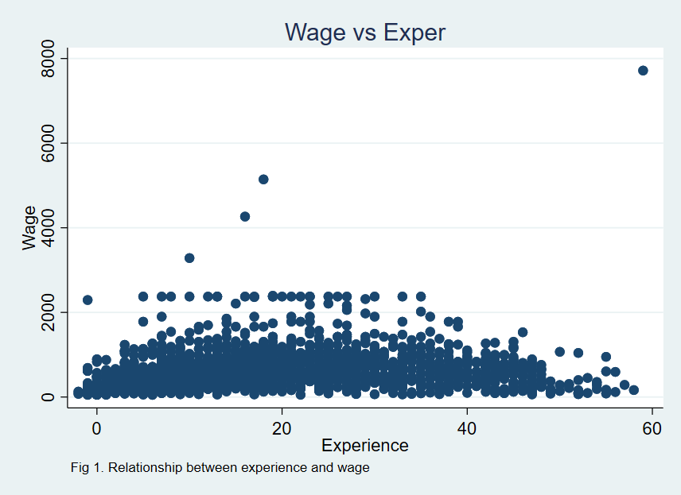
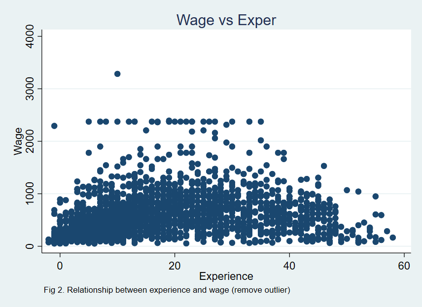
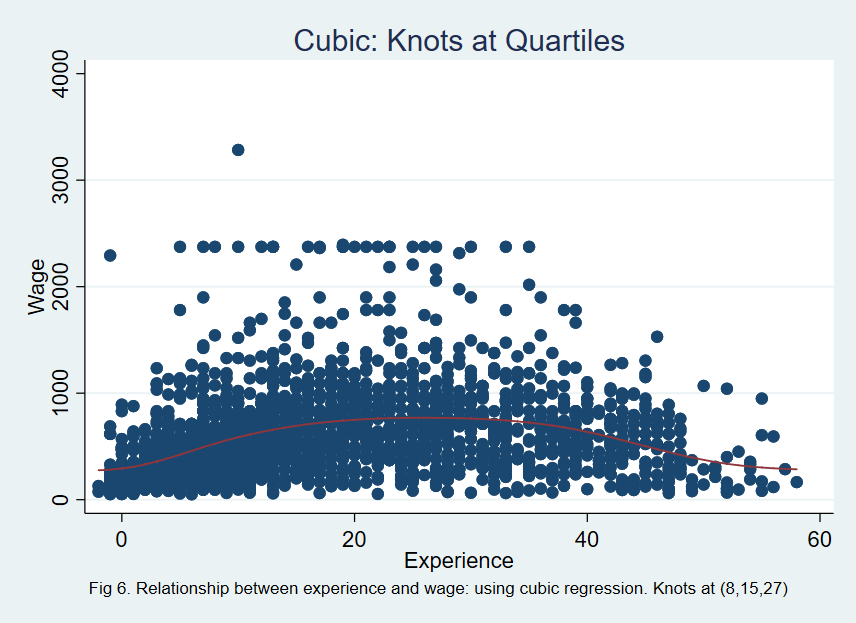
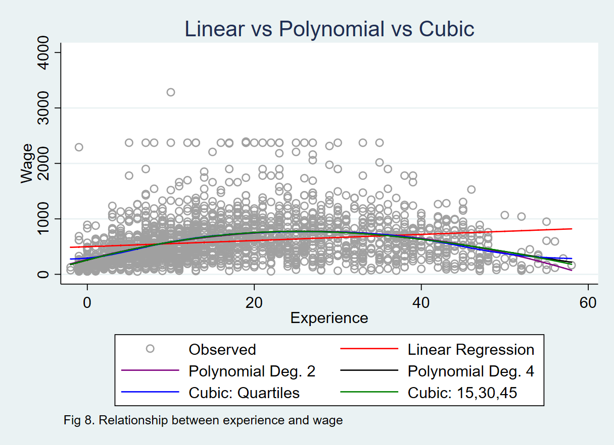

```{r setup, include=FALSE}
knitr::opts_chunk$set(echo = TRUE)
library(splines)
library(faraway)
library(dplyr)
library(ggplot2)
library(knitr)
library(reticulate)
use_python("/Users/mandy/anaconda3/bin/python")
```


# Introduction to Cubic Spline Regression

Cubic regression spline is a form of generalized linear models in regression analysis. Also known as B-spline, it is supported by a series of interior basis functions on the interval with chosen knots. Cubic regression splines are widely used on modeling nonlinear data and interaction between variables. Unlike traditional methods such as polynomial regression or broken stick regression, cubic regression spline takes both smoothness and local influence into consideration (Faraway, 2015). According to Julian J Faraway, the basis functions need to be a continuous cubic polynomial that is nonzero on an interval defined by knots and zero anywhere else to ensure the local influence. Also, the first and second derivatives of the polynomials at each knotpoint should be continuous to achieve the overall smoothness.  (Faraway, 2015). More details of cubic regression spline can be found at [link](http://data.princeton.edu/eco572/smoothing2.html)

We will provides three analysis examples produced by R with package splines, STATA with package mkspline and Python with package statsmodels, sklearn.metrics and patsy. In each example, we will first clean the data and remove outliers, fit the ols and polynomial regression models as alternative and finally fit the cubic regression spline models and compare their goodness-of-fit to the alternative models. 

The result shows that cubic splines have the best fit compared to ols and polynomial regression, which benefits from its focus on local influence as stated before. In addition, the fitted model of cubic splines are smooth and will be significantly better than the other two methods when applied to higher dimensional data. Limited by the scale of this tutorial, we only focus on the local influence advantage of cubic splines.


# Data Summary

In this project, we'll be using dataset uswages from R package faraway. The dataset can be found at [link](https://github.com/xiaotoYang/CubicSpline/blob/master/uswages.csv). Uswages contains the weekly wages data for US male works collected from the Current Population Survey in 1988. It has 2000 observations and 10 variables. The detailed description of variables are as follows:

```{r data, include = FALSE}
data(uswages)
type = as.character(sapply(uswages, typeof))
explain = c("Real weekly wages in dollars",
            "Years of education",
            "Years of experience",
            "1 if Black, 0 if White (other races not in sample)",
            "1 if living in Standard Metropolitan Statistical Area, 0 if not",
            "1 if living in the North East",
            "1 if living in the Midwest",
            "1 if living in the West",
            "1 if living in the South",
            "1 if working part time, 0 if not"
            )
var_explain = as.data.frame(cbind("Variables" = names(uswages), "Type" = type, "Explanation" = explain))
```

```{r data_table}
kable(var_explain, caption = "Variable description")
```


In this tutorial, we will focus on the relationship between response variable wage and prediction variable experience. The two-dimensional relationship is easier to present and allows us to better illustrate cubic regression spline method.

# I. Applying Cubic Regression Spline with R

## Data Cleaning

Regression spline methods are easy to apply with R packages splines. To load data and draw plots, package faraway and ggplot2 are also needed.
```{r load}
# Load packages and data
library(splines)
library(faraway)
library(ggplot2)
library(dplyr)
data(uswages)
ggplot(uswages, aes(exper, wage))+geom_point(col = "slategrey")+
  labs(x = "Experience in year", y = "Weekly wage")+
  ggtitle("Relationship between weekly wages and years of experience")
```

From the plot, we can observe that there are a few outliers with extremely high wage. To avoid the influence of outliers on regression models, we remove observations with wage larger than 4000.

```{r clean}
# Remove outliers
uswages = filter(uswages, wage<4000)
```

## Benchmark
First, let's try to capture the relationship with ordinary least square model (ols). 

```{r ols}
# Fit an ols model as benchmark
fit1 = lm(wage~exper, data = uswages)
plot(uswages$exper, uswages$wage, xlab = "Weekly wage", 
     ylab = "Experience", main = "OLS model", col = "slategrey")
abline(fit1, col = "red")
```

From the plot, we can see that OLS model fails to catch most of the variabnce in the data. 

## Alternative models: Polynomial regression

Polynomial regression is a good alternative in this case. The linear models with polynomial of degree 2 and degree 4 are shown as follows:

```{r poly}
# Fit polynomial regression models with degree 2 and 4
g2 = lm(wage~poly(exper, 2), data = uswages)
g4 = lm(wage~poly(exper, 4), data = uswages)
uswages = mutate(uswages, degree2 = fitted(g2), degree4 = fitted(g4))
ggplot(uswages, aes(exper, wage)) +
  labs(x = "Experience in year", y = "Weekly wage")+
  geom_point( col = "slategrey") + 
  geom_line(aes(exper, degree2,color = "2"))+
  geom_line(aes(exper, degree4,color = "4")) +
  scale_color_manual(values = c(
    '2' = 'darkblue',
    '4' = 'red')) +
  labs(color = 'Polynomial degree')+
  ggtitle("Polynomial regression models")
```

## Cubic Regression Splines

Polynomial regression models are smooth but the shortcomings are overfitting problem and each data point affect the fit globally. Cubic regression spline, however, by seperate data into subsets, greatly mitigate the problem. We first used the 25%, 50% and 75% quantiles as the set of knots. The result after cubic spline regression is as follows:

```{r spline}
# Fit regression spline model with chosen knots
# 8, 15 and 27 are the quantiles for wage
cubic_spline = lm(wage~bs(exper, knots = c(8,15,27)), data = uswages)
uswages = mutate(uswages, smooth = fitted(cubic_spline))
ggplot(uswages, aes(exper, wage)) + 
  labs(x = "Experience in year", y = "Weekly wage")+
  geom_point(col = "slategrey") +
  geom_line(aes(exper, smooth), col = "red") + 
  ggtitle("Cubic regression spline model")
summary(cubic_spline)
```

Alternatively, we can even split the range of predictor variable experience into 4 subsets and use the breakpoints as the knots. In this way, we get 15, 30 and 45. 

```{r spline2}
# Fit regression spline model with chosen knots
cubic_spline2 = lm(wage~bs(exper, knots = c(15, 30, 45)), data = uswages)
uswages = mutate(uswages, smooth2 = fitted(cubic_spline2))
ggplot(uswages, aes(exper, wage)) + 
  labs(x = "Experience in year", y = "Weekly wage")+
  geom_point(col = "slategrey") +
  geom_line(aes(exper, smooth2), col = "red") + 
  ggtitle("Cubic regression spline model")
summary(cubic_spline2)
```

## Summary

To better compare the goodness of fit of each model, we attached a MSE table below. 

```{r summary}
mse = function(model){
 rmse = sqrt(mean(model$residual^2))
 round(rmse, 3)
 }
mse_ols = mse(fit1)
mse_poly1 = mse(g2)
mse_poly2 = mse(g4)
mse_cubic = mse(cubic_spline)
mse_cubic2 = mse(cubic_spline2)

model_name = c("OLS", "Polynomial with degree 2", "Polynomial with degree 4", "Cubic Spline 1", "Cubic Spline 2")
mses = c(mse_ols, mse_poly1, mse_poly2, mse_cubic, mse_cubic2)
mse_table = cbind(model_name, mses)
colnames(mse_table) = c("Models", "RMSE")
kable(mse_table, caption = "Mean squared errors for different models", digits = 3)
```

In this table, we can find that the cubic spline regression with knots (8, 15, 27) has the best fit. In general, cubic splines are better than polynomial regressions, which are better than ols. 


# II. Applying Cubic Regression Spline with Python
## 1. Loading packages
In this python tutorial, pandas is required for data manipulation, statsmodel is require for building regression models and matplolib is for plotting.
```{python}
import numpy as np
import pandas as pd
import statsmodels.api as sm
import statsmodels.formula.api as smf
import matplotlib.pyplot as plt
from math import sqrt
from sklearn.metrics import mean_squared_error
from patsy import dmatrix
from scipy import interpolate
```

## 2. Import dataset using pandas
```{python}
# read dataset
data = pd.read_csv("uswages.csv")
print(data.head())
```

## 3. Data Exploration
We can see that wage and experience has a non-linear relationship.
```{python}
## exper vs wage ##
data_x = data[['exper']]
data_y = data[['wage']]

#visualize the relationship between experience and wage
plt.scatter(data_x, data_y, facecolor = 'None', edgecolor = 'k', alpha = 0.3)
plt.suptitle('Fig 1. Relationship between experience and wage', fontsize=12)
plt.xlabel('experience')
plt.ylabel('wage')
plt.show()
```

Looking at Fig 1., there seems to be an outlier (the wage that is above 7000), therefore, in this tutorial, we will remove that outlier and continue our model building, we reduce the data down to wage <= 4000.
```{python}
# remove outlier
data_ylim = data.loc[data['wage']<= 4000]
wage = data_ylim[['wage']]
exper_x = data_ylim[['exper']]

#visualize the relationship between experience and wage
plt.clf()
plt.scatter(exper_x, wage, facecolor = 'None', edgecolor = 'k', alpha = 0.3)
plt.suptitle('Fig 2. Relationship between experience and wage (remove outlier)', fontsize=12)
plt.xlabel('experience')
plt.ylabel('wage')
plt.show()
```


## 4. Simple Linear Regression
First we will add an intercept in our simple linear regression model, then use sm.OLS from statsmodels to do the analysis.
```{python}
#add an intercept (beta_0) to our model
exper_x = sm.add_constant(exper_x)  

# model fitting
model = sm.OLS(wage, exper_x).fit()

# find fitted value
predictions1 = model.predict(exper_x) 
```

By looking at Fig 3., apparently, we can't use simple linear regression to explain the relationship between wage and experience, since there exists a non-linear association between wage and experience.
```{python}
# data visualization
plt.clf()
plt.scatter(exper_x['exper'], wage, facecolor = 'None', edgecolor = 'k', alpha = 0.3)
plt.plot(exper_x['exper'], predictions1, color = 'green', linewidth = 1.5)
plt.suptitle('Fig 3. Simple linear regression', fontsize=12)
plt.xlabel('experience')
plt.ylabel('wage')
plt.show()
```

Calculating RMSE value: 
```{python}
rms1 = sqrt(mean_squared_error(wage, predictions1))
print(rms1)
```


## 5. Polynomial Regression
Next we will try using polynomial regression to access the relationship by setting "experience" to degree = 2. Again, we will use sm.OLS from statsmodel to do this analysis.
```{python}
# refit model using polynomial regression ("exper" with degree = 2)
exper_x['exper2'] = np.power(exper_x['exper'], 2)

# model fitting
model2 = sm.OLS(wage, exper_x).fit()

# find fitted value
predictions2 = model2.predict(exper_x) 
```

The polynomial curve on Fig 4. does explain the non-linear relationship between wage and experience.
```{python}
# reduce samples down to 100
x_lim = np.linspace(start = exper_x['exper'].min(), stop = exper_x['exper'].max(), num = 100)
x_lim_df = pd.DataFrame({'exper':x_lim})
x_lim_df['exper2'] = np.power(x_lim_df['exper'], 2)
x_lim_df = sm.add_constant(x_lim_df) 

# find fitted value using x_lim
fit_reduce = model2.predict(x_lim_df)

# data visualization
plt.clf()
plt.scatter(exper_x['exper'], wage, facecolor = 'None', edgecolor = 'k', alpha = 0.3)
plt.plot(x_lim_df[['exper']], fit_reduce, color = 'blue', linewidth = 1.5, label='experience with degree = 2')
plt.legend()
plt.suptitle('Fig 4. Polynomial regression (degree = 2)', fontsize=12)
plt.xlabel('experience')
plt.ylabel('wage')
plt.show()

```

Calculating RMSE value: 
```{python}
rms2 = sqrt(mean_squared_error(wage, predictions2))
print(rms2)
```

## 6. Polynomial regression with degree up to 4
Next, we add higher degree of experience in the model.
```{python}
# "exper" with degree = 4
exper_x['exper3'] = np.power(exper_x['exper'], 3)
exper_x['exper4'] = np.power(exper_x['exper'], 4)

# model fitting
model3 = sm.OLS(wage, exper_x).fit()

# find fitted value
predictions3 = model3.predict(exper_x)


# reduce samples down to 100
x_lim = np.linspace(start = exper_x['exper'].min(), stop = exper_x['exper'].max(), num = 100)
x_lim_df = pd.DataFrame({'exper':x_lim})
x_lim_df['exper2'] = np.power(x_lim_df['exper'], 2)
x_lim_df['exper3'] = np.power(x_lim_df['exper'], 3)
x_lim_df['exper4'] = np.power(x_lim_df['exper'], 4)
x_lim_df = sm.add_constant(x_lim_df) 

# find fitted value using x_lim
fit_reduce2 = model3.predict(x_lim_df)
```

Fig. 5 shows the polynomial regression curve when degree of experience is up to 4. The curve looks similar to Fig 4.
```{python}
# data visualization
plt.clf()
plt.scatter(exper_x['exper'], wage, facecolor = 'None', edgecolor = 'k', alpha = 0.3)
plt.plot(x_lim_df[['exper']], fit_reduce2, color = 'purple', linewidth = 1.5, label='experience with degree up to 5')
plt.legend()
plt.suptitle('Fig 5. Polynomial regression (degree = 4)', fontsize=12)
plt.xlabel('experience')
plt.ylabel('wage')
plt.show()
```

Calculating RMSE value: 
```{python}
rms3 = sqrt(mean_squared_error(wage, predictions3))
print(rms3)
```


## 7. Cubic Regression, knots = 8, 15, 27
We select 8, 15, 27 as our knots, which are the 25th , 50th and 75th quantile in variable experience, and use sm.GLM from statsmodels to build cubic regression model.
```{python}
# cubic spline with 4 knots at 8, 15, 27
cubic_x1 = dmatrix("bs(data, knots = (8, 15, 27), include_intercept = False)", {"data": exper_x[['exper']]}, return_type = 'dataframe')

# model fitting
model4 = sm.GLM(wage, cubic_x1).fit()

# find fitted value
predictions4 = model4.predict(cubic_x1)

print(model4.summary())

# reduce samples down to 100
x_lim = np.linspace(exper_x[['exper']].min(), exper_x[['exper']].max(), 100)

# find fitted value using x_lim
fit_reduce3 = model4.predict(dmatrix(formula_like = "bs(train, knots = (8, 15, 27), include_intercept = False)", data = {"train": x_lim}, return_type = 'dataframe'))

```

The spline curve on Fig 5. does explain the non-linear relationship between wage and experience.
```{python}
# plot spline
plt.clf()
plt.scatter(exper_x[['exper']], wage, facecolor='None', edgecolor='k', alpha=0.1)
plt.plot(x_lim, fit_reduce2, color='r', linewidth = 1.5, label='Specifying 3 knots, knots = (8, 15, 27)')
plt.legend()
plt.suptitle('Fig 6. Cubic regression, knots = (8, 15, 27)', fontsize=12)
plt.ylim(0, 5000)
plt.xlabel('experience')
plt.ylabel('wage')
plt.show()
```

Calculating RMSE value:
```{python}

rms4 = sqrt(mean_squared_error(wage, predictions3))
print(rms4)
```

## 8. Cubic Regression, knots = 15, 30, 45
Next, we select other three knots 15, 30, 45, which are in same interval from experience, and do the cubic regression.
```{python}
# cubic spline with 4 knots at 15, 30, 45
cubic_x2 = dmatrix("bs(data, knots = (15, 30, 45), include_intercept = False)", {"data": exper_x[['exper']]}, return_type = 'dataframe')

# model fitting
model5 = sm.GLM(wage, cubic_x2).fit()

# find fitted value
predictions5 = model5.predict(cubic_x2)

print(model5.summary())

# reduce sample to 100
x_lim = np.linspace(exper_x[['exper']].min(), exper_x[['exper']].max(), 100)

# find fitted value using x_lim
fit_reduce4 = model5.predict(dmatrix(formula_like = "bs(train, knots = (15, 30, 45), include_intercept = False)", data = {"train": x_lim}, return_type = 'dataframe'))
```

The spline curve on Fig 6 is slightly different from Fig 5 at higher experience value, this might be due to the lower sample size at the last knot.
```{python}
plt.clf()
plt.scatter(exper_x[['exper']], wage, facecolor='None', edgecolor='k', alpha=0.1)
plt.plot(x_lim, fit_reduce4, color='y', linewidth = 1.5, label='Specifying 3 knots, knots = (15, 30, 45)')
plt.legend()
plt.suptitle('Fig 7. Cubic regression, knots = (15, 30, 45)', fontsize=12)
plt.ylim(0, 5000)
plt.xlabel('experience')
plt.ylabel('wage')
plt.show()
```

Calculating RMSE value: 
```{python}
rms5 = sqrt(mean_squared_error(wage, predictions5))
print(rms5)
```


## 9. Summary
By looking at Fig 6, we can see that polynomial curve and spline curve do overlap with each other, and their residual RMSE both look similar with spline's MSE seems to be slightly smaller.
```{python}
# overlay three regression curve
plt.clf()
plt.scatter(exper_x[['exper']], wage, facecolor='None', edgecolor='k', alpha=0.1)
plt.plot(exper_x['exper'], predictions1, color = 'green', linewidth = 1.5, label = 'Simple Linear Regression')
plt.plot(x_lim_df['exper'], fit_reduce, color = 'blue', linewidth = 1.5, label='Polynomial Regression, experience degree = 2')
plt.plot(x_lim_df['exper'], fit_reduce2, color = 'purple', linewidth = 1.5, label='Polynomial Regression, experience up to degree = 4')
plt.plot(x_lim, fit_reduce2, color='r', linewidth = 1.5, label='Cubic Regrssion, knots = (8, 15, 27)')
plt.plot(x_lim, fit_reduce3, color='y', linewidth = 1.5, label='Cubic Regrssion, knots = (15, 30, 45)')
plt.legend()
plt.suptitle('Fig 8. Relationship between experience and wage', fontsize=12)
plt.ylim(0, 5000)
plt.xlabel('experience')
plt.ylabel('wage')
plt.show()
```

compare root of MSE: 
```{python}
# compare mse
model = ['SLR', 'Polynomial (degree = 2)', 'Polynomial (degree = 4)', 'Spline(knots = 8, 15, 27)', 'Spline(knots = 15, 30, 45)']
RMSE = [rms1, rms2, rms3, rms4, rms5]
compare = pd.DataFrame({'Model':model, 'RMSE':RMSE})
print(compare)
```


```{r, echo=FALSE, message=FALSE}
require(knitr)
library(Statamarkdown)
stataexe <- find_stata()
knitr::opts_chunk$set(engine.path=stataexe)
```

#III. Applying Cubic Regression Spline with STATA

## 1. Loading Packages

In this tutorial, stata is used to perform the analysis. To build the cubic spline regression model, a package called bspline is needed. More information about the package can be found here (https://www.stata-journal.com/sjpdf.html?articlenum=sg151_2)

```{stata, results = "hide"}
ssc install bspline
ssc install markstat
ssc install whereis
```

## 2. Import Dataset

We start by loading the data and presenting the first 4 observations.

```{stata}
import delimited uswages.csv
list in 1/4
```

## 3. Data Exploration

This dataset is exploring how wages in the U.S. are affected by certain variables. For simplicity, we will be regressing the variable experience onto wage and looking at the resulting relationship. First we will visualize how these 2 variables are related. We notice that wage and experience has a non-linear relationship. We can also see that there seems to be a few outliers. We remove data points where wage is greater than 4000.

```{stata}
import delimited uswages.csv
summarize
summarize wage exper, detail
```

```{stata}
import delimited uswages.csv
twoway (scatter wage exper), ytitle(Wage) xtitle(Experience) legend(off) note("Fig 1. Relationship between experience and wage") title("Wage vs Exper") name(Scatter)
```




```{stata}
import delimited uswages.csv
drop if wage > 4000
twoway (scatter wage exper), ytitle(Wage) xtitle(Experience) legend(off) note("Fig 2. Relationship between experience and wage (remove outlier)") title("Wage vs Exper") name(Scatter2)
```




## 4. Simple Linear Regression

First we will do OLS Regression. From Fig 3., it does not appear that linear regression is suitable to explain the relationship between wage and experience. We note from the output that the RMSE value is 404.95.

```{stata, message = FALSE}
import delimited uswages.csv
regress wage exper
predict linear_wage_exper
twoway (scatter wage exper)(line linear_wage_exper exper, sort), ytitle(Wage) xtitle(Experience) legend(off) note("Fig 3. Relationship between experience and wage: using simple linear regression") title("Linear") name(Linear)
```


## 5. Polynomial Regression

Next we perform polynomial regression and fit a quadratic by setting "experience" to degree = 2. The polynomial seems to explain the non-linearity somewhat better than linear regression. We note from the output that the RMSE value is 381.67.

```{stata}
import delimited uswages.csv
regress wage c.exper##c.exper
predict quad_wage_exper
twoway (scatter wage exper)(line quad_wage_exper exper, sort), ytitle(Wage) xtitle(Experience) legend(off) note("Fig 4. Relationship between experience and wage: using polynomial regression") title("Polynomial: Degree 2") name(Degree2)
```


## 6. Polynomial Regression to the 4th Degree

Next, we'll try adding a higher degree of experience to the model.

```{stata}
import delimited uswages.csv
regress wage c.exper##c.exper##c.exper##c.exper
predict degfour_wage_exper
twoway (scatter wage exper)(line degfour_wage_exper exper, sort), ytitle(Wage) xtitle(Experience) legend(off) note("Fig 5. Relationship between experience and wage: using polynomial regression") title("Polynomial: Degree 4") name(Degree4)
```


The curve looks similar to Fig 4. Note that the RMSE is 381.67

## 7. Cubic Regression, Knots = 8, 15, 27

For the cubic regression model, we select 8, 15, and 27 as our knots, which are the 25th, 50th, and 75th quartiles for the experience variable. Here we use the bspline package. 

```{stata}
import delimited uswages.csv
bspline, xvar(exper) knots(8,15,27) gen(cubic_wage_exper_spline) power(3)
regress wage cubic_wage_exper_spline*
predict cubic_wage_exper_spline
twoway (scatter wage exper)(line cubic_wage_exper_spline exper, sort), ytitle(Wage) xtitle(Experience) legend(off) note("Fig 6. Relationship between experience and wage: using cubic regression. Knots at (8,15,27)") title("Cubic: Knots at Quartiles") name(Cubic)
```




The cubic regression spline also seems to model the non-linear relationship better than a linear fit, although it does not look significantly different from the polynomial regressions performed earlier. Note the RMSE value of 382.23.


One may notice that the coefficients produced from the cubic regression in Stata compared to Python and R look quite different. We attempt to explain this in the Discussion section below.

## 8. Cubic Regression, knots = 15, 30, 45

Next, we select evenly spaced knots at 15, 30, and 45 and perform the cubic regression again.

```{stata}
import delimited uswages.csv
bspline, xvar(exper) knots(15,30,40) gen(cubic_wage_exper_spline_even) power(3)
regress wage cubic_wage_exper_spline_even*
predict cubic_wage_exper_spline_even
twoway (scatter wage exper)(line cubic_wage_exper_spline_even exper, sort), ytitle(Wage) xtitle(Experience) legend(off) note("Fig 7. Relationship between experience and wage: using cubic regression. Knots at (15,30,40)") title("Cubic: Evenly Spaced Knots") name(Cubic2)
```


The spline curve from Fig 7. is slightly different from that of Fig 6. at higher values of experience. We suspect this might be due to lower sample size at the last knot. Note the RMSE value of 381.95.

## 9. Summary

Looking at a plot of all of the curves, we can see that the splines and polynomial curves overlap each other somewhat. In python and R, the spline's RMSE is slightly smaller than the polynomial's. However, in Stata, the spline's RMSE is slightly bigger than the polynomial's. We still might expect the cubic fit to be a little more accurate because of the local influence property from the knots.

```{stata, message = FALSE, echo = FALSE, warning = FALSE, include = FALSE}
import delimited uswages.csv
twoway (scatter wage exper)(line linear_wage_exper quad_wage_exper degfour_wage_exper cubic_wage_exper_spline cubic_wage_exper_spline_even exper, sort), ytitle(Wage) xtitle(Experience) legend(label(1 "Observed") label(2 "Linear Regression") label(3 "Polynomial Deg. 2") label(4 "Polynomial Deg. 4") label(5 "Cubic: Quartiles") label(6 "Cubic: 15,30,45")) note("Fig 8. Relationship between experience and wage") title("Linear vs Polynomial vs Cubic") name(All)
```



# Discussion

The coefficients for the cubic spline regression in Stata look quite different from the coefficients from R and Python. We believe that this could possibly be due to how the spline functions are scaled in the bspline package. If $y(t) = \sum x_i(t)\beta_i$, it could also be that $y(t) = \sum (\frac{x_i(t)}{C}) * C\beta_i$ where C is some constant. We believe this is happening here.

We can try to reproduce the cubic spline regression results with knots at 8, 15, 27 from scratch using the basis functions. We can then sum the predictions from the bspline package and those from scratch and compare. More information about rescaling of the basis functions can be found here (https://www.researchgate.net/publication/4794073_BSPLINE_Stata_modules_to_compute_B-splines_parameterized_by_their_values_at_reference_points
)

```{stata}
import delimited uswages.csv
gen exper2 = exper^2
gen exper3 = exper^3
gen k8 = cond(exper > 8, (exper - 8)^3, 0)
gen k15 = cond(exper > 15, (exper - 15)^3, 0)
gen k27 = cond(exper > 27, (exper - 27)^3, 0)
regress wage exper exper2 exper3 k8 k15 k27
predict cubic_wage_exper
bspline, xvar(exper) knots(8,15,27) gen(cubic_wage_exper_spline) power(3)
regress wage cubic_wage_exper_spline*
predict cubic_wage_exper_spline
sum cubic_wage_exper cubic_wage_exper_spline
```

# Reference
Notes: FARAWAY, J. J. (2015). Linear Models With R, Second Edition (2nd ed.). Boca Raton, FL: Taylor & Francis.

R package: splines [link](https://www.rdocumentation.org/packages/splines/versions/3.5.1)

Python package: statsmodels [link](https://www.statsmodels.org/stable/index.html), patsy [link](https://patsy.readthedocs.io/en/latest/spline-regression.html)

STAT package: bspline [link](http://data.princeton.edu/eco572/smoothing2.html)


